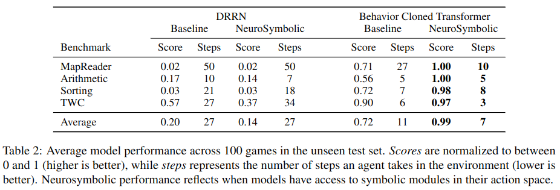

# Behavior Cloned Transformers are Neurosymbolic Reasoners
This repository is for the paper ["Behavior Cloned Transformers are Neurosymbolic Reasoners"](https://arxiv.org/abs/2210.07382) (EACL 2023)

## Plain Language Description of this Paper

This paper shows that, for multi-step problems, you can almost trivially teach a large language model (like T5) to use external symbolic modules that you yourself author (in, say, Python code).  We evaluate this using a very explicit multi-step problem (four text games).  At each step in the text game, the T5 agent chooses an action it would like to take.  If the action is a known game action (e.g. "read math problem"), the action passes to the game engine as normal, and the agent observes the response (e.g. "the math problem says: divide 22 by 11").  But, if the action is for a symbolic module (like a calculator, GPS, knowledge-base query, or sorting tool) then sends the action to the module to generate a response (e.g. calculator module: `divide 22 by 11`.  calculator module response: `the result is 2`).  The language model can then use that response from the symbolic module to augment its reasoning capablities with things it's not good at (like math, or navigation, or sorting, or knowledge base queries) to help select better actions for the multi-step problem (i.e. the text game, in this paper).

<p align="center" width="100%">
    
</p>

This can be almost trivially implemented with a wrapper function (here, called `performAction()`) that intercepts the action the agent generates, and checks to see if it is a known symbolic action.  If it is, the symbolic module is called, otherwise the action passes through to the environment as normal, as this block of pseudocode shows:
```python
# symbolic-example.py

# Perform an action in the text game, and get a response back. 
# If the action starts with a known prefix for a symbolic module,
# then the action is passed to the symbolic module for processing.
# Otherwise, the action is passed to the text game for processing.
def performAction(actionStr:str):
    # Check for a known prefix for a symbolic module.
    if actionStr.startswith("calc"):
        # Pass the action to the calculator symbolic module for processing.
        return calcModule(actionStr)
    elif actionStr.startswith("navigate"):
        # Pass the action to the navigation symbolic module for processing.
        return navigateModule(actionStr)
    elif actionStr.startswith("kb_query"):
        # Pass the action to the knowledge base symbolic module for processing.
        return kbQueryModule(actionStr)
    elif actionStr.startswith("sort"):
        # Pass the action to the sorting symbolic module for processing.
        return sortModule(actionStr)
    else:
        # Normal pass-through case.  Do not intercept the action, but instead
        # pass the action to the text game for processing.
        return textGame(actionStr)


# Example of one symbolic module
# Perform the calculator symbolic module action
def calcModule(actionStr:str):
    # Extract the command and arguments.  Expected format: "calc add 2 3"
    tokens = actionStr.split()
    # Ensure the module prefix is as expected (e.g. "calc")
    modulePrefix = tokens[0]
    if (modulePrefix != "calc"):
        return "ERROR: Incorrect module. Expected 'calc' but got '" + modulePrefix + "'"
    # Extract the command and arguments
    command = tokens[1]
    arg1 = tokens[2]
    arg2 = tokens[3]
    # Perform the action
    resultStr = ""
    if (command == "add"):
        resultStr = "The result is " + str(int(arg1) + int(arg2))
    elif (command == "subtract"):
        resultStr = "The result is " + str(int(arg1) - int(arg2))
    elif (command == "multiply"):
        resultStr = "The result is " + str(int(arg1) * int(arg2))
    elif (command == "divide"):
        resultStr = "The result is " + str(int(arg1) / int(arg2))
    else:
        resultStr = "ERROR: Unknown command '" + command + "'"

    return resultStr

# Example placeholders for other symbolic modules
def navigateModule(actionStr):
    # ...
    return ""

def kbQueryModule(actionStr):
    # ...
    return ""

def sortModule(actionStr):
    # ...
    return ""
```    

(Note that a somewhat more elegant way of implementing this is included in [symbolicModule.py](symbolicModule.py), that makes registering new symbolic modules and actions easier). 

This technique can result in a *very large increase in task performance* (in terms of both task accuracy, and task efficiency -- i.e. the number of steps it takes to solve a task).  As shown in Figure X in the paper, this increases the modest-to-moderate performance (using T5 without symbolic modules) on each of the 4 text games we tested on up to essentially ceiling performance (using T5 with symbolic modules):

<p align="center" width="100%">
    
</p>


## Navigating the Repository
**1. I want to see the code for how the symbolic modules were implemented:**

The code for implementing the symbolic modules can be found in [symbolicModule.py](symbolicModule.py).  The code is highly templated, with the goal of making it reusable (i.e. portable into your code), or to make it easy for you to add new symbolic modules into this code base. 

The actual call from the T5 agent to the symbolic module interface is in the T5Agent() function, approximately here: https://github.com/cognitiveailab/t5-textworldexpress/blob/26f9305fbf89661005b26831b49b83ef5f2b2b2f/main.py#L1172 . The code looks like this:

```python
            # Take a step in the environment
            # First, check to see if the command is intended for a module
            moduleWasRun, moduleResult = moduleInterface.runCommand(actionToTake)
            if (moduleWasRun == True):
                # Symbolic module was run -- add result to current 'info'
                info = addModuleResultToInfo(lastRawInfo, moduleResult, actionToTake)
                lastRawInfo['lastActionStr'] = ""
            else:
                # Command was not intended for symbolic module -- run environment
                info = env.step(actionToTake)
                lastRawInfo = info            

            # Give modules observations from environment
            moduleInterface.giveEnvironmentStatus(lastRawInfo['observation'], lastRawInfo['inventory'], lastRawInfo['look'])    
            # Sanitize info, and add in module commands to valid actions
            info = sanitizeInfo(info, moduleInterface) 
```
If you're familiar with common reinforcement learning/gym APIs, this looks very similar (i.e. `env.step()`).  There's just an added check to see if the action generated by the agent (here T5) is intended for the symbolic module or the environment.  If it's intended for a symbolic module, the API essentially injects the output of the symbolic module into the observation of the gym API, so that it just looks like any other observation from the environment.  This makes this technique very easy to integrate with existing agents. 

The call to `moduleInterface.giveEnvironmentStatus()` essentially gives all the symbolic modules access to whatever the agent is currently seeing.  This is helpful because some of the modules (e.g. the navigation module) passively scrape information from the environment, like where the agent is, or (when the agent happens to find and read a map) what the environment map looks like.


**2. I want to see the code for the T5 agent:**

The code for implementing the agent can be found in [main.py](main.py).

**3. I want to see how the training data for the symbolic modules was generated:**

The text game engine (TextWorldExpress) provides gold agents (and gold solution paths) for every generated game.  To generate training data for the T5 agent with the symbolic modules, we run these paths, but inject calls to symbolic modules at specific critical times in the action sequence/solution.  The code for these is in [main.py](main.py), in specific named functions.  For exmaple, for the TextWorld Common Sense (TWC) game, gold data is generated in `runGoldPathsTWC()`. 

Completed raw training data (i.e. prompt->response or input->output or source->target files, depending on which terminology you prefer) that are used for training the T5 sequence-to-sequence model are available at: https://github.com/cognitiveailab/t5-textworldexpress/tree/master/training-data

**4. I want to see the model results (scores, full action histories):**

These are available in the following folders:
- Results without modules (baseline): https://github.com/cognitiveailab/t5-textworldexpress/tree/master/results-nomodule
- Results with symbolic modules: https://github.com/cognitiveailab/t5-textworldexpress/tree/master/results-withmodule

**5. I want to see the tuning results:**

Summaries of results (tuning over number of epochs) are available here: 

- No module (baseline): https://github.com/cognitiveailab/t5-textworldexpress/blob/master/tuning-nomodule/tuning-results-nomodule.txt
- With symbolic modules: https://github.com/cognitiveailab/t5-textworldexpress/blob/master/tuning-withmodule/tuning-results-withmodule.txt

Raw data is available in the same folders. 


**6. I want to train my own models from scratch:**


## Replicating the experiments
**1. Clone the repository:** **TODO CHANGE REPO NAME**
```bash
git clone git clone https://github.com/cognitiveailab/t5-textworldexpress.git
cd t5-textworldexpress
```

**2. Install Dependencies:**
```bash
conda create --name t5-neurosymbolic python=3.9
conda activate t5-neurosymbolic
pip install -r requirements.txt
```
You may want to install the pytorch manually if your GPU does not support CUDA 11.

**3. Download Spacy model:**
```bash
python -m spacy download en_core_web_sm
```

**4. Train the T5 model:**
Use the Huggingface Seq2seq trainer to train a T5 model using the pre-generated training data.  We've provided runscripts in the `runscripts` folder for training each of the 4 games, in each of the two modes (with/without modules).  The runscript takes a single paramter, the number of training epochs.  For example, to train the T5 model for the Arithmetic game, with symbolic modules, the command would be: 
```bash
runscripts/runme-train-arithmetic.sh 4
```

This will save the trained model in a verbosely named folder (e.g. `t5twx-game-arithmetic-withcalcmodule-base-1024-ep4`). 


**5. Evaluate the performance of that model on unseen variations of the game:**

We'll use the above example as a follow-through:

`python main.py --game_name=arithmetic --num_variations 100 --max_steps=20 --train_or_eval=eval --set=dev --lm_path=t5twx-game-arithmetic-withcalcmodule-base-1024-ep4  --useSymbolicModules=calc`

This will generate two verbosely-named output logs: 
- `resultsout-arithmetic-modcalccalc-lmt5twx-game-arithmetic-withcalcmodule-base-1024-ep4-setdev.json`: a summary file describing the overall scores for each game variation. 
- `t5saveout-gamearithmetic-lmt5twx-game-arithmetic-withcalcmodule-base-1024-ep4-dev-10000-10099.json`: a detailed file with the complete play logs of each variation.


**Running different games/modes:**
The relevant parameters when calling main are: 
- **game_name**: one of: `arithmetic, mapreader-random, sorting, twc-easy`
- **lm_path**: the name of the trained model from Step 4
- **useSymbolicModules**: one of: `calc, navigation, sortquantity, kb-twc`

See the file [runscripts/runme-tuning-batch-with-module.sh](runscripts/runme-tuning-batch-with-module.sh) for more examples.


# Frequently Asked Questions (FAQ)
**Q: What symbolic modules were implemented in this work?**

A: (1) A *calculator* for arithmetic (+, -, *, /). (2) A *navigation* module that helps perform pathfinding by providing the next location to traverse to move closer towards a destination. (3) A *knowledge base lookup*, that provides a list of triples that match a query term.  (4) A *sorting* module, that sorts lists of quantities in ascending order, and is unit-aware (e.g. 50 milligrams is less than 10 grams). 

**Q: What model size did you use?**

A: As we note in the broader impacts, one of the benefits of augmenting language models with symbolic modules is that you can use smaller models and still get good performance.  For the experiments reported here we used T5-base (220M parameter) model. 

**Q: How long does it take to train and evaluate the models?**

A: As an example, it generally takes under 10 minutes on an RTX 4090 to train the T5-base model that uses symbolic modules for the Arithmetic game when training up to 4 epochs.  Evaluting each of the 100 variations in the dev or test set takes a little longer, but still on the order of about 10 minutes. 

**Q: What was the tuning procedure?**

A: Behavior Cloned Transformer model performance was tuned on a single hyperparameter (number of training epochs), tuned from 2 to 20 epochs in 2 epoch increments.  There are islands of high and low performance, so it's highly recommended to tune. 

**Q: How much training data is required?**

A: While we didn't run an analysis of performance versus training data size for the EACL paper, it does not appear as though much data is required for this technique to work.  For all games, models are trained on 100 training games, which (nominally) corresponds to 100 examples of the symbolic module being used.  For the arithmetic game where there are technically four different module actions being used (add, sub, mul, div), the model sees each action only 25 times during training, and still achieves near perfect performance.  All of these results are on T5-base, a 220M parameter model, and the model has no pretraining on the text game (i.e. it has to learn to play the game, and use the symbolic module at the same time).  This suggests modest amounts of training data are required for the model to learn to use these symbolic modles, at least for the games explored in this paper.

**Q: What information is packed into the prompt of the T5 agent?**

A: The T5 agent prompt is essentially a first order Markov model -- it sees information from the current step, and the previous step (longer is generally not possible due to the token length limitations of the input).  The specific packing here is: 
`promptStr = task_description + ' </s> OBS ' + cur_obs + ' </s> INV ' + cur_inv + ' </s> LOOK ' + cur_look + ' </s> <extra_id_0>' + ' </s> PACT ' + prev_action + ' </s> POBS ' + prev_obs + ' </s>' `. 

Where `task_description` is the game task description (so the model knows the overall task it's supposed to complete), `cur_obs` is the latest observation string from the text game or symbolic module, `cur_inv` is the current agent inventory, and `cur_look` is equivalent to the "look" action in the game at the current time step.  `prev_action` is the last action the agent chose, and `prev_obs` is the previous observation, which will be from the symbolic module if the previous action was for a symbolic module, and otherwise from the text game engine.

**Q: What text games did you use?**

A: We use 3 games made for this paper (arithmetic, mapreader, and sorting), and one existing benchmark text game called [TextWorld Common Sense (Murugesan et al., AAAI 2021)](https://ojs.aaai.org/index.php/AAAI/article/view/17090).  All games were implemented using [TextWorldExpress (repo)](https://github.com/cognitiveailab/TextWorldExpress), a new and extremely fast engine for simulating text games in natural language processing research ([also accepted to EACL as a demo paper (PDF)](https://arxiv.org/abs/2208.01174)).  TextWorldExpress is `pip` installable, and you can generally be up and running in minutes.

**Q: What is the difference between the `mapreader` and `mapreader-random` games used here?**

A: We implemented two versions of the mapreader game that have different map generation properties (and report results with `mapreader-random' in the paper).  The original `mapreader` has random but still highly regular maps -- e.g., the kitchen usually connects to the backyard and the pantry, the living room usually connects to the hallway, and so forth.  It turns out T5 is reasonably good at learning small regular maps after seeing them repeatedly in training data, and does okay at the map navigation task because it's already learned most of the map generation properties.  In contrast, `mapreader-random` generates a random map essentially without generation constraints (e.g. the pantry is not constrained to only connect to the kitchen).  This is a much harder task, and requires use of a symbolic module for navigation.

**Q: Why use text games as an evaluation?**

A: Text games are an exciting new research paradigm for evaluating multi-step reasoning in natural language processing.  They require models to perform explicit multi-step reasoning by iteratively observing an environment and selecting the next action to take.  This generally requires combining a variety of common-sense/world knowledge as well as task-specific knowledge to solve.  As we show in another paper ([ScienceWorld (EMNLP 2022)](https://aclanthology.org/2022.emnlp-main.775/)), models that perform extremely well on question answering tasks perform very poorly when those same tasks are reframed as text games, that explicitly test multi-step/procedural knowledge.  Here's a [survey paper on using text games in natural language processing](https://aclanthology.org/2022.wordplay-1.1/), that provides a quick overview of the field.

**Q: I have a question, comment, or problem not addressed here.**

A: We're committed to supporting this work.  Please create a github issue (which should send us an e-mail alert), or feel free to e-mail `pajansen@arizona.edu` if you prefer.

## ChangeLog/Other Notes
- Feb-23-2023: Updated to latest TextWorldExpress API for release, so we can just use the pip installable version of TWX.  Please post any issues. 
- Feb-23-2023: Cleaned up repository for release, moving many files.  Please report any broken links/issues. 


## Citing

If this EACL 2023 paper is helpful in your work, please cite the following:

```
@article{wang2022neurosymbolicreasoners,
  title={Behavior Cloned Transformers are Neurosymbolic Reasoners},
  author={Wang, Ruoyao and Jansen, Peter and C{\^o}t{\'e}, Marc-Alexandre and Ammanabrolu, Prithviraj},
  journal={arXiv preprint arXiv:2210.07382},
  year={2022},
  url = {https://arxiv.org/abs/2210.07382},
}

```
(Will update with EACL 2023 bibtex when available)
